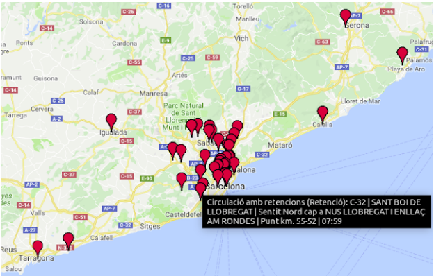

# CityRoad_Disruptions
Social media provide real-time and up-to-date information about the events happening at a given location that can be used to build automatic systems to react to such events. This project is about building a system to consume streams of data from this sources in order to detect possible disruptions in the city and its transport network, and use that data to improve navigation services. The project explores and implements state-of-the-art techniques to model and process natural language data at scale.

